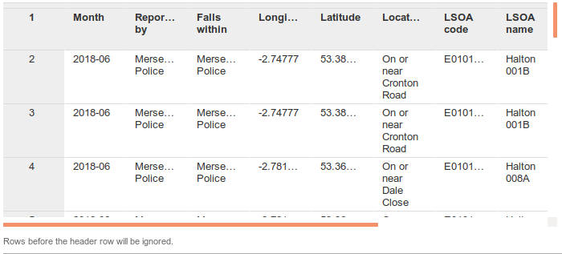

<!-- compiled locally using pandoc -o worksheet.html worksheet.md -->

# Digital Space: Practical

## Section 1: Data with Coordinates

*In this section we will be taking some data with coordinates and plotting them on a map using Google Fusion Tables*

# add in link to data

- Download the data we will be using from X and save it in Documents (or somewhere else you can find it). *This is a series of crimes from the Merseyside Police area for June 2018. Have a look at the data in Excel if you like.*
<!-- Deleted CrimeID column from source data as with it, the file would not load into Google Fusion Tables -->
- Go to **<a href="http://drive.google.com" target="_blank">Google Drive</a>**. Sign in to your Google Account or create a Google Account if you don't already have one.
- Click the **New** button.
- Click the **More** button.
- Click the **Connect more apps** bar at the bottom of the resulting list.
- Type **fusion tables** in the **Search Apps** box and hit the Enter key.
- On **Fustion Tables (experimental)** click the blue **+ CONNECT** button, then click the **OK** button in the confirmation dialog box.
- Close the **Connect more apps** window. 
- Click **New > More > Google Fusion Tables"**.
- In the Import new table dialog box, click **Browse**.
- Browse to where you downloaded *file.xls* and select it. 
- Click **Next**.
- Check that the data is formatted correctly as shown in the picture below and click **Next**.

#(screenshot of table)

- Give your table a name. 
- Add some notes to this page, potentially explaining where you got the data from. For example you could say: *Data used in GIS exercise from Northwest Digital Research Methods Festival, 13th Sept 2018*. 
- Click **Finish**.

Fusion Tables auto-detects location data in a table and displays a tab called **Map of <location column name>**. In this case, the Map tab is titled **Map of Latitude**.

- Click **Map of latitude**.

This will automatically show the data on a map, using the coordinate data provided. Try clicking on each point - it will give you more detais. Using the Filter by tool, we can select out specific types of crime. 

- Click **Filter**.
- Select **Crime type**.
- Click the checkbox on one of the crime types. Note how the map updates automatically. 

Experiment with the different crime type options. Do you notice any spatial patterns?

We also have the option of creating a heat map. Have an experiment with the options. Is the heat map any help? What does it show?

## Section 2: Data with Addresses

We can use the same approach for data without coordinates, using postal addresses instead. 

# update file location liverpool-addresses-v2.csv

- Download the file from X. *(This is just a list of random addresses in Liverpool I have come up with. Have a look in Excel if you like).* 
- Go back to Google Drive, and click **New > More > Google Fusion Tables"** as before.
- Load in the file you have just downloaded.
- Click **Next** as before.
- Click **Map of Liverpool St.** Google will automatically geocode the addresses. This may take a little bit of time, so be patient. There are about 100 addresses, so it will take about 1-2 min to process. 
- When it is finished, you may need to zoom in to Liverpool to look at the data.

We can also do the same process without postcodes - although the results are less reliable. Try experimenting with this file (XX). 

As will all maps, you should always check the results you are getting. Do they make sense? Are the addresses geocoded in the correct place?

### One with postcodes (v2) and one without (v3). 

# test in firefox, chrome, ie, Liverpool RD. 

